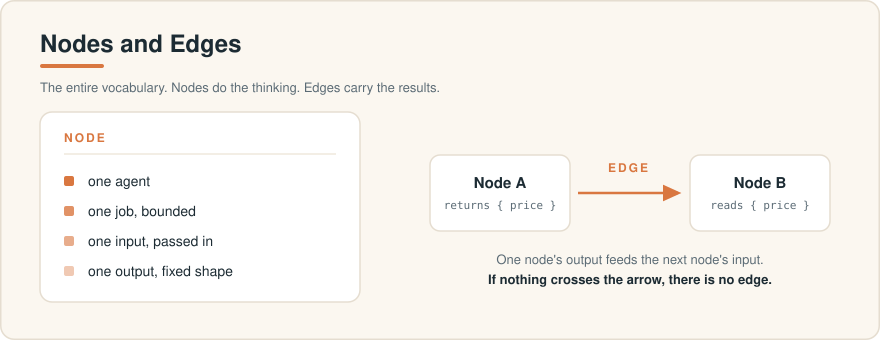
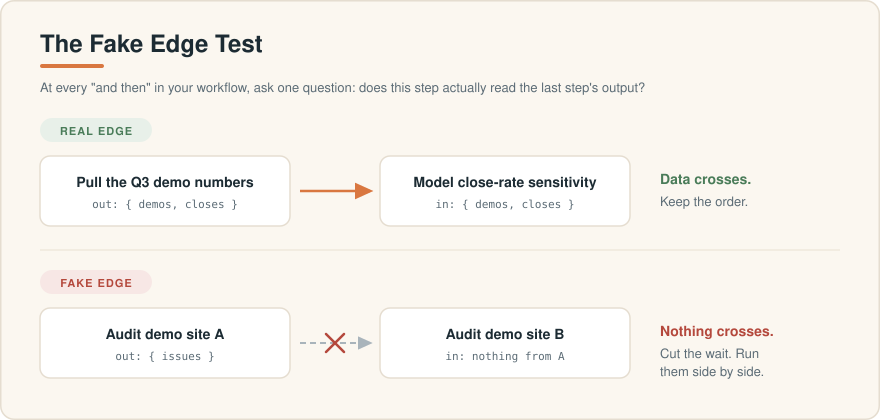
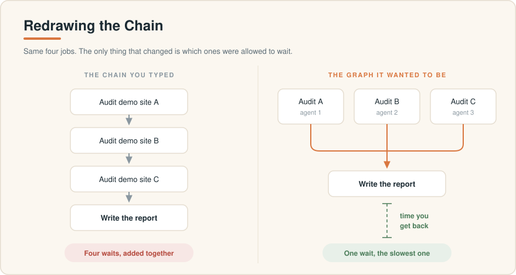
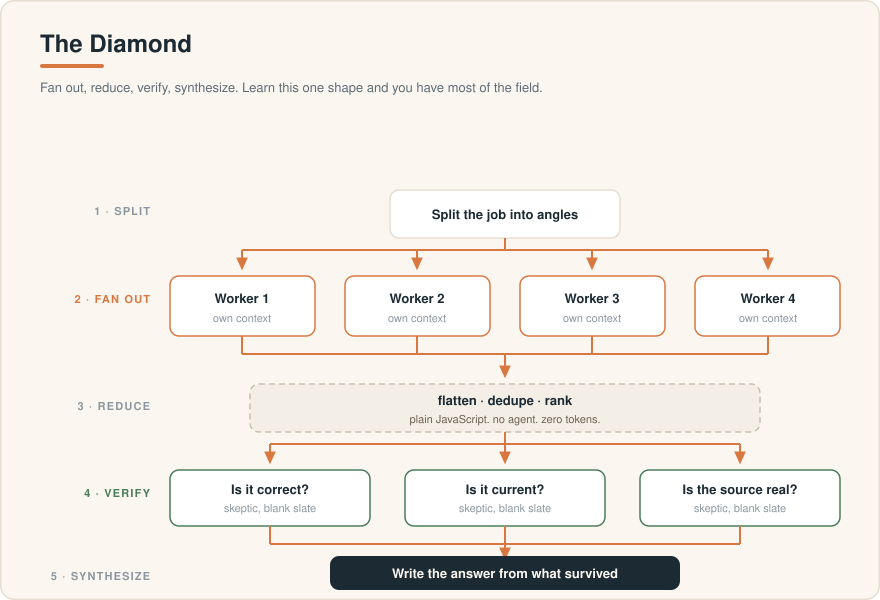
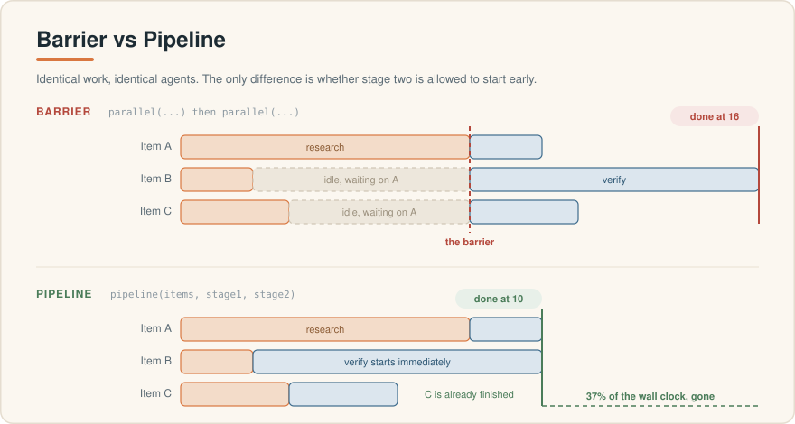
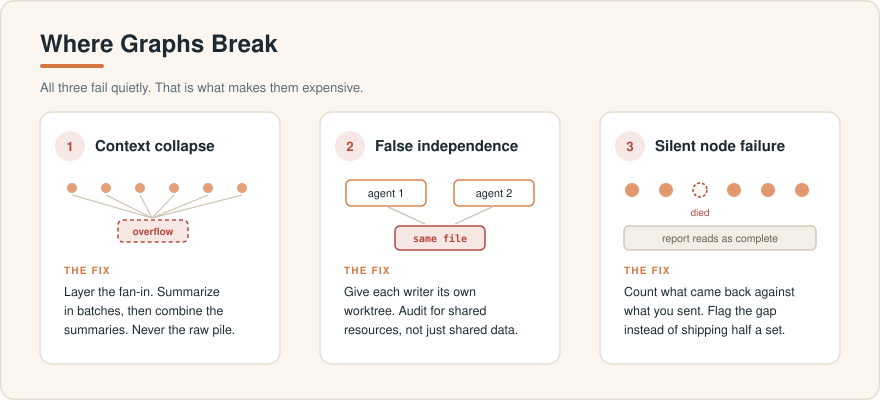
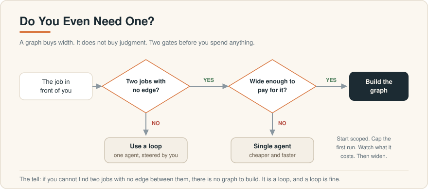

# Graph Engineering for Operators

**How to stop queueing your AI in a straight line.**

Written for people who run businesses, not research labs.

> First in a series. The second is [Eval Engineering for Operators](https://github.com/wilsonwu-ai/eval-engineering-for-operators), on building the gate that decides what your agents are allowed to ship. This one is about throughput. That one is about what you do with the output.

---

I run three things at once: an investment vehicle, a revenue org at a portfolio company, and an apparel business. I am also most of the way through a computer science master's at night. Time is the only input I cannot buy more of, so I spend a lot of my thinking on the same question a capital allocator asks about money: *given a fixed pool, where does the next unit go, and what does it buy?*

Graph engineering is that question applied to AI work. It is not a new frontier technique. It is an allocation discipline. And the first move in it is free.

This is my working write-up of the idea: what it is, the one test that pays for itself immediately, the single pattern worth memorizing, where it breaks, when it is the wrong tool, what it actually costs, and the exact code that runs it. I have corrected a handful of API details that are circulating wrong in the popular explainers, because getting them wrong means your script does not run.

**Reading time: about 18 minutes. Everything here is runnable today in Claude Code.**

---

## Contents

1. [The one paragraph version](#1-the-one-paragraph-version)
2. [ELI5: a kitchen at Friday dinner rush](#2-eli5-a-kitchen-at-friday-dinner-rush)
3. [Nodes and edges, the whole vocabulary](#3-nodes-and-edges-the-whole-vocabulary)
4. [The fake edge test, which is free money](#4-the-fake-edge-test-which-is-free-money)
5. [Your workflow is already a graph, just the saddest one](#5-your-workflow-is-already-a-graph-just-the-saddest-one)
6. [Contracts: what makes a node wire-able](#6-contracts-what-makes-a-node-wire-able)
7. [The diamond, the only shape you have to learn](#7-the-diamond-the-only-shape-you-have-to-learn)
8. [The verifier is the whole trick](#8-the-verifier-is-the-whole-trick)
9. [Barrier vs pipeline, the latency lever](#9-barrier-vs-pipeline-the-latency-lever)
10. [Cycles that actually converge](#10-cycles-that-actually-converge)
11. [Where graphs break](#11-where-graphs-break)
12. [Do you even need one?](#12-do-you-even-need-one)
13. [What it costs, honestly](#13-what-it-costs-honestly)
14. [Anchors, or why topology alone does not buy truth](#14-anchors-or-why-topology-alone-does-not-buy-truth)
15. [Build one in ten minutes](#15-build-one-in-ten-minutes)
16. [Corrections to what is circulating](#16-corrections-to-what-is-circulating)
17. [What I am actually doing with this](#17-what-i-am-actually-doing-with-this)
18. [Sources](#18-sources)

---

## 1. The one paragraph version

Most people run their AI as a line. Do A, then B, then C, then D. Roughly half of those "then"s are fake: step C never actually reads what step B produced, it just happens to be typed underneath it. Every fake "then" is wall clock you are paying for and not getting anything back. If you redraw the line as a picture of what genuinely depends on what, independent work runs at the same time, a separate checker kills the bad findings before they reach your answer, and one job pulls it all together. That picture is a graph. Drawing it costs you five minutes with a pen. Running it costs real money, which is why the second half of this article is about when *not* to.

---

## 2. ELI5: a kitchen at Friday dinner rush

I spend a lot of my week around restaurants, so this is the analogy that made it click for me.

Imagine a kitchen that runs like most people's AI workflows. The grill cook sears the steak. Then, when he is completely finished, the garde manger starts the salad. Then, when *she* is finished, the pastry chef starts plating dessert. Then the expo looks at the plate and sends it out.

Nobody runs a kitchen that way. Tickets would take an hour and the dining room would empty.

A real kitchen runs like a graph:

- **The stations are the nodes.** Grill, salads, fry, pastry. Each one has a single job, gets a defined input (a ticket), and produces a defined output (a component of the plate).
- **The pass is the fan-in.** Everything converges there and only there.
- **The expo is the verifier.** Their entire job is to look at a plate somebody else made and try to find what is wrong with it before it leaves the kitchen. Critically, the expo did not cook the food. That is the point of the expo.
- **The ticket rail carries the dependencies.** The salad does not wait on the steak, because the salad never needed the steak. The plate waits on both.

The salad and the steak have **no edge between them**. That is the entire insight. Find the pairs in your own work with no edge between them, stop making one wait for the other, and put an expo on the pass.

Everything below is that idea, made precise enough to run.

---

## 3. Nodes and edges, the whole vocabulary



There are exactly two things.

**A node is a box.** One agent, one bounded job, one input in, one output out. "Research this competitor's pricing." "Audit this file." "Write the summary." If you cannot say what a node's job is in one sentence, it is two nodes.

**An edge is an arrow.** It means one node needs what another node produced, so it has to wait. Nothing else.

The mistake almost everybody makes is treating the word "then" as an edge. "Summarize this contract and then check the weather in Boston" has no edge in it. The weather does not read the summary. Those are two disconnected boxes that a straight-line script chains together for no reason.

Nodes do the thinking. Edges carry the results. That is the whole vocabulary, and you never need a definition again.

---

## 4. The fake edge test, which is free money



Here is the single highest-return thing in this entire article, and it requires no new tool, no new subscription, and about five minutes.

**Take the AI workflow you actually run today. Walk it step by step. At each step ask one question: does this step read the previous step's output?**

If yes, the edge is real. Keep the order.

If no, there is no edge. The wait is pure waste.

A concrete one from my own week. I ask for: "audit demo site A for stale menu pricing, then audit demo site B, then audit site C, then write me a summary." Read it back. The audit of site B never looks at what site A returned. Neither does C. There are three fake edges in a four-step workflow. The only real edge is the one into the summary, because the summary genuinely needs all three.

Run the three audits at the same time and the job finishes in the time of the slowest single site, not the sum of all three.

You will find two or three fake edges in nearly any workflow you draw. Every one of them is time you were throwing away for free. **This test is worth more to most people than the rest of this article combined**, because it works whether or not you ever build a real graph.

---

## 5. Your workflow is already a graph, just the saddest one



When you write "do A, then B, then C, then D," you have already drawn a graph. It is a single unbranching chain where every node has one arrow in and one arrow out.

It runs correctly. It also runs slowly and it breaks badly, because a chain has no redundancy. If C stalls, D never happens, and A's work is stranded upstream with nowhere to go.

The arithmetic is worth sitting with. A forty-step linear workflow has forty points of sequential failure and a wall clock equal to all forty added together. The same forty jobs drawn honestly usually have three to five genuine dependencies and finish at the speed of the slowest layer. That is the difference between a job that takes fifteen minutes and one that takes ninety seconds, running the identical work with the identical model.

The model was never the bottleneck. The line you typed was.

---

## 6. Contracts: what makes a node wire-able

A node you cannot reason about is a node you cannot parallelize. The fix is a contract: bounded input, bounded output, exactly one job.

The output shape is the part people skip, and it is the part that matters. A node that returns a wall of prose is a node only a human can read. A node that returns a fixed shape is one the next node can consume without guessing.

In Claude Code's dynamic workflows you enforce this with a JSON schema. When you hand `agent()` a schema, the subagent is forced to call a structured-output tool, and validation happens at the tool-call layer, so a mismatch triggers a retry instead of handing you free text to parse and pray over.

```js
// A node with a real contract: bounded in, validated out, one job.
const FINDING = {
  type: 'object',
  additionalProperties: false,
  properties: {
    site:   { type: 'string' },
    issue:  { type: 'string' },
    url:    { type: 'string' },
    impact: { type: 'string', enum: ['high', 'medium', 'low'] },
  },
  required: ['site', 'issue', 'url', 'impact'],
};

const finding = await agent(
  `Audit ${site.url}. Report any menu item whose listed price does not match ${site.pos}.`,
  { label: `audit:${site.name}`, phase: 'Audit', schema: FINDING },
);
// `finding` is now a shape the next node can trust, not prose you have to interpret.
```

One thing that is easy to miss: **the reduce step between nodes is plain JavaScript.** Flattening, deduping, filtering, ranking by a numeric field. All of that is code operating on shapes your nodes already returned. No agent required.

This is a quiet but large win. A lot of what people burn model tokens on is really an edge, and edges are close to free. The temptation is to spawn an agent to "combine the results." Resist it. If combining means flatten and dedupe, that is `results.flatMap(...)` and a `Set`. Deterministic, instant, no tokens. Save agents for judgment, not for plumbing.

---

## 7. The diamond, the only shape you have to learn



You do not need a catalogue of topologies. Watch any serious agent system work and the same picture keeps appearing. The work splits, several workers dig side by side, something checks what they found, and it all merges into one answer.

That is the diamond. Its formal name is worth memorizing: **fan out, reduce, synthesize** (with a verify pass wedged in before the synthesis if the answer matters).

Here is the real thing, with the real API. Note the `meta` block. Every workflow script needs one, and it has to be a pure literal, no variables or function calls inside it.

```js
export const meta = {
  name: 'demo-site-audit',
  description: 'Audit every demo site for stale menu data, verify each finding, rank the result',
  phases: [
    { title: 'Audit',      detail: 'one agent per site' },
    { title: 'Verify',     detail: 'an independent skeptic per finding' },
    { title: 'Synthesize', detail: 'one ranked report' },
  ],
};

const SITES = args.sites;   // passed in when the workflow is launched

// FAN OUT and VERIFY as a pipeline. Each site's findings go straight into
// verification the moment that site's audit lands. No site waits on the slowest one.
const perSite = await pipeline(
  SITES,

  // stage 1: one auditor per site
  (site) => agent(
    `Audit ${site}. Report menu items whose listed price is stale. Every finding needs a URL.`,
    { label: `audit:${site}`, phase: 'Audit', schema: FINDINGS },
  ),

  // stage 2: one skeptic per finding from that site
  (found, site) => parallel(
    found.issues.map((issue) => () =>
      agent(
        `Try to REFUTE this finding. Default to refuted:true if you are not certain.\n${JSON.stringify(issue)}`,
        { label: `verify:${site}`, phase: 'Verify', schema: VERDICT },
      ).then((v) => ({ ...issue, kept: Boolean(v) && !v.refuted })),
    ),
  ),
);

// REDUCE: plain JavaScript. No agent. No tokens.
const returned = perSite.filter(Boolean).length;
if (returned < SITES.length) {
  log(`WARNING: ${SITES.length - returned} of ${SITES.length} sites returned nothing`);
}
const kept = perSite.filter(Boolean).flat().filter((f) => f && f.kept);

// SYNTHESIZE: one node, the whole surviving set
phase('Synthesize');
return agent(
  `Write one report ranked by impact from these confirmed issues:\n${JSON.stringify(kept)}`,
  { phase: 'Synthesize', schema: REPORT },
);
```

Read that once and the craft is visible: fan out where the work is independent, reduce in free code, verify on a clean context, count what came back, and synthesize once at the end.

Swap the sites for competitors and it is a market scan. Swap them for public comps and it is a comps sheet. Swap them for route files and it is a security audit. Same skeleton.

Once you can see the diamond, you stop asking "how do I make my agent do more steps" and start asking "where is the split, where is the merge." That second question is the one that scales.

---

## 8. The verifier is the whole trick

This is the part people skip, and it is what separates a real graph from an expensive toy.

**Never let the node that did the work check the work.** A model grading its own output is far too easy on itself. You put a separate node on the edge, and its only job is to try to kill the finding before it moves downstream. If it survives, it passes. If not, it dies there.

There is a mechanical detail that matters more than it sounds: **the verifier needs a clean context.** Hand it the same conversation the worker had and it is not checking anything, it is nodding along to itself in a different font. A graph of agents sharing one context is a single loop wearing a costume, and it fails the same way, only later and more expensively.

The good news is that in Claude Code's workflows this is automatic, not a setting. Every `agent()` call spawns a subagent with its own context. It sees the prompt you gave it and nothing else. You do not turn this on. You just have to avoid defeating it by pasting the worker's entire reasoning into the verifier's prompt. Pass the *finding*, not the transcript.

Three patterns worth having in hand:

**Adversarial verify.** Spawn N independent skeptics per finding, each explicitly told to refute it and to default to "refuted" when uncertain. Keep it only if a majority survive.

```js
const votes = await parallel(
  Array.from({ length: 3 }, () => () =>
    agent(`Try to refute this claim: ${claim}. If you are not certain, return refuted:true.`,
          { schema: VERDICT }),
  ),
);
const survives = votes.filter(Boolean).filter((v) => !v.refuted).length >= 2;
```

**Perspective-diverse verify.** When a finding can be wrong in more than one way, give each verifier a different lens rather than running three identical skeptics. Is it correct? Is it current? Does the cited source actually say this? Diversity catches failure modes that redundancy never will. This is the one I use for anything that touches a number in a model.

**Judge panel.** Generate N independent attempts from different angles, score them with parallel judges, then synthesize from the winner while grafting in the best ideas from the runners-up. Beats one-attempt-iterated whenever the solution space is genuinely wide.

---

## 9. Barrier vs pipeline, the latency lever



This is the choice that trips people up, and it is worth real money in wall clock.

`parallel()` is a **barrier**. It waits for every thunk before it returns. Nothing in the next stage starts until the slowest thing in this stage finishes.

`pipeline()` has **no barrier between stages**. Each item runs through all stages independently. Item A can be in stage three while item B is still in stage one.

In the diagram above, three items each go through research then verify. Item A is slow to research and quick to verify. Item B is the reverse. With a barrier, the run costs (slowest research) plus (slowest verify), because the two slow phases never overlap. With a pipeline, it costs the slowest single item's own chain. Same agents, same prompts, 37% less wall clock.

**Default to `pipeline()`.** Reach for a barrier only when a stage genuinely needs every prior result at once:

- deduping across the complete set before expensive downstream work
- early-exiting when the total count came back zero
- a prompt that explicitly compares a finding against all the others

A barrier is **not** justified by "I need to flatten the list first" (do that inside a pipeline stage) or "the stages feel conceptually separate" (that is what a pipeline models). Separate is not the same as synchronized.

The smell test is brutal and simple. If you wrote:

```js
const a = await parallel(...);
const b = transform(a);          // flatten, map, filter, no cross-item dependency
const c = await parallel(b.map(...));
```

that middle transform did not need the barrier. Rewrite it as a pipeline with the transform inside a stage.

---

## 10. Cycles that actually converge

Sometimes you do not know how big the job is until you are inside it. A bug sweep where finding one bug reveals three more. A compliance review where one bad clause implies a family of them. That needs a cycle: a controlled edge back to an earlier node.

The danger is obvious. A cycle that does not converge is an infinite loop that spawns agents until your budget is gone.

The pattern that converges is **loop until dry**: keep spawning finders until K consecutive rounds turn up nothing new, then stop.

And here is the detail that almost everyone gets wrong the first time: **dedupe against everything you have seen, not against what you confirmed.** If you dedupe against confirmed findings only, every finding your judges rejected reappears next round, gets rejected again, and the loop never runs dry. You have built a machine that pays to rediscover the same dead ends forever.

```js
const seen = new Set();
const confirmed = [];
let dry = 0;

while (dry < 2) {                                   // stop after two empty rounds
  const round = (await parallel(
    FINDERS.map((f) => () => agent(f.prompt, { phase: 'Find', schema: BUGS })),
  )).filter(Boolean).flatMap((r) => r.bugs);

  const fresh = round.filter((b) => !seen.has(key(b)));
  if (!fresh.length) { dry++; continue; }

  dry = 0;
  fresh.forEach((b) => seen.add(key(b)));           // dedupe vs SEEN, not vs confirmed

  const judged = await parallel(
    fresh.map((b) => () =>
      parallel(['correctness', 'security', 'reproduces'].map((lens) => () =>
        agent(`Judge "${b.desc}" through the ${lens} lens. Is it real?`,
              { phase: 'Verify', schema: VERDICT }),
      )).then((votes) => ({
        bug:  b,
        real: votes.filter(Boolean).filter((v) => v.real).length >= 2,
      })),
    ),
  );

  confirmed.push(...judged.filter((j) => j.real).map((j) => j.bug));
}
```

If you have a token target set for the turn, guard the loop on it. Without a target, `budget.remaining()` is `Infinity` and the loop runs to the hard 1000-agent backstop:

```js
while (budget.total && budget.remaining() > 50_000) { /* ... */ }
```

---

## 11. Where graphs break



All three of these fail quietly, which is exactly what makes them expensive.

**Context collapse.** You fan out to a thousand nodes, then try to feed a thousand raw outputs into one synthesis step, and you blow the context window before synthesis begins. The fix is to layer the fan-in: batch the results, summarize each batch, then combine the summaries. The final node reads twenty-five summaries, not a thousand raw dumps.

```js
const batches   = chunk(results, 40);
const summaries = await parallel(
  batches.map((b) => () => agent(`Summarize this batch:\n${JSON.stringify(b)}`, { schema: SUMMARY })),
);
return agent(`Write the answer from these summaries:\n${JSON.stringify(summaries.filter(Boolean))}`);
```

**False independence.** Two nodes look independent because their prompts never mention each other, but they write to the same file, or hit the same rate-limited API. That is a hidden edge, and it will corrupt results silently. If nodes actually write in parallel, isolate them:

```js
await parallel(files.map((f) => () =>
  agent(`Refactor ${f}`, { isolation: 'worktree' }),   // each agent gets its own git worktree
));
```

Use `isolation: 'worktree'` only when nodes genuinely write in parallel. It costs setup time and disk per agent. It is a seatbelt for one specific topology, not a default tax on every run.

**Silent node failure.** In a chain, one failure stops everything: annoying, but obvious. In a graph, one dead node out of two hundred slides into a report that reads as complete. A thunk that throws inside `parallel()` resolves to `null` rather than rejecting the batch, which is what keeps one flaky agent from sinking the run. Your `.filter(Boolean)` is the containment. But containment without accounting is how you ship half a dataset and call it a full one:

```js
const results = (await parallel(jobs)).filter(Boolean);
if (results.length < jobs.length) {
  log(`WARNING: ${jobs.length - results.length} of ${jobs.length} nodes returned nothing`);
}
```

Every fan-in should count what came back against what it sent. If a run bounds coverage on purpose (top-N, sampling, no retry), log what got dropped. Silent truncation reads as "we covered everything" when you did not.

---

## 12. Do you even need one?



Being honest about who this is for is more useful than selling it.

**A graph buys breadth. It does not buy judgment.** It is a tool for width: independent work done at once. When the work is not wide, the straight line was never your problem.

Skip the graph when:

- **The task is small or isolated.** One function, one bug, one email. The coordination is pure overhead and a single agent is faster and cheaper.
- **You want to approve every step.** The point of a graph is running wide without you in the loop. A tight leash works against it.
- **You do not yet know what you are looking for.** Exploratory work wants one agent you can steer, not a fleet locked into a plan you drew before you understood the problem.
- **The steps genuinely depend on each other.** Forcing a graph onto truly sequential work adds cost for zero speedup.

The tell is the fake edge test. If you cannot find two jobs with no edge between them, there is no graph to build. It is a loop, and a loop is fine.

---

## 13. What it costs, honestly

A graph costs more than a chat. Considerably more. What gets cheaper is the *coordination*, because the control flow is a JavaScript script rather than another turn of a model reasoning about what to do next. The agents themselves still burn tokens, and a fleet of them burns a pile.

The clearest public data point I have seen is the Bun runtime port that circulated in July 2026. As reported in the source articles linked at the bottom: roughly 535,000 lines of one language translated into over a million lines of another, in about eleven days, across roughly 50 workflows with up to 64 agents running at once, at a reported cost of roughly $165,000 in usage. It also required a human designing and supervising the whole thing, and drew legitimate criticism about whether that volume of AI-written code can be meaningfully reviewed.

**I have not independently verified those figures and neither should you.** Treat them as an order of magnitude, not a quote. The order of magnitude is the useful part: this is a technique with a real bill attached, and the bill scales with the width you asked for.

Practical guardrails I use:

1. **Cap the first run.** "20 files on this first run," not "every file in the repo." You are buying information about what a run costs before you buy the run.
2. **Log what you dropped.** A capped run that does not say it was capped is a lie by omission to your future self.
3. **Tier the models.** Not every node needs your best one. Bounded, repetitive nodes (extract this field, classify this ticket) go cheap. Judgment nodes (adjudicate this finding, write the report) stay up top. By default every subagent inherits the session model, so a wide run bills entirely at your session tier unless you say otherwise.

```js
// boring, bounded, repetitive: send it down
agent(prompt, { model: 'haiku', effort: 'low',  schema: EXTRACT });

// the node where the judgment actually lives: keep it up
agent(prompt, { model: 'opus',  effort: 'high', schema: REPORT });
```

That one lever turns a token-hungry graph into an economical one without touching its shape.

---

## 14. Anchors, or why topology alone does not buy truth

This is the part I care about most, because it is the failure mode I would actually fall into.

Picture the full build. Paired checkers. Audit nodes. Meta-nodes tuning the other nodes. Every node watches another node, and every one of them reads a report. The audit node checks the numbers against the finance numbers, which came out of the same system that produced the report in the first place.

Everything is consistent. Nothing is verified.

That graph fails exactly the way a single loop fails, just later, more expensively, and with far more green lights on the way down.

**A graph needs anchors: inputs that cannot be argued with.** Tests that actually ran, not tests that "should pass." Revenue that landed in the bank, not revenue in the model. Customers who renewed. A filing you can open. And some rules have to be frozen, specifically the ones an optimizer would be tempted to bend, because those are precisely the ones it will bend to win.

The graph is only as honest as the things inside it that refuse to move. Judge it against numbers that cannot argue back and it stays grounded. Let it grade its own reports and it will be confidently, elaborately wrong.

If you take one thing from this section: **the verifier must consume an anchor, not another opinion.** Otherwise you have built a very expensive echo.

---

## 15. Build one in ten minutes

You do not have to write the script. Put the word **workflow** in your prompt and Claude writes the orchestration script itself, then spawns the fleet to run it. The intermediate results live inside the script rather than in your session, which is what lets a run scale to dozens of agents without drowning your context. What lands at the end is one report, not thirty transcripts to dig through.

Below are four specs I actually use, pulled from the four things I run. Ready-to-paste versions are in [`workflows/`](workflows/). Swap the bracketed parts.

### A. Multi-site audit (operations)

```text
▸ GRAPH SPEC
GOAL:        audit every site listed in [file/list] for [stale pricing / broken links / wrong hours]

FAN OUT:     one agent per site, in parallel
CONTRACT:    every finding returns { site, issue, url, impact }
VERIFY:      an independent skeptic per finding, told to refute by default
REDUCE:      dedupe by url, rank by impact
CAP:         20 sites on this first run
ON FAIL:     report how many sites came back vs how many I sent, never skip silently
REPORT:      one ranked list, plus the count check

(start the prompt with the word "workflow")
```

### B. Decision-grade research (investing)

The one that replaces a week of tab-hopping. Note that the verify step is doing the work here, not the research step.

```text
▸ GRAPH SPEC
GOAL:        decision-grade research on [question]

FAN OUT:     split into 5 distinct angles, one researcher per angle, in parallel
CONTRACT:    every finding needs a source URL and a publication date. no source, no finding.
VERIFY:      three skeptics per finding on distinct lenses:
             (1) is the claim correct  (2) is it current  (3) does the cited source actually say this
             keep only what survives a majority
REDUCE:      dedupe by source, rank by confidence
SAVE:        research-report.md with every claim carrying its citation
HUMAN GATE:  change nothing after that without asking me

(start the prompt with the word "workflow")
```

### C. Catalog copy audit (ecommerce)

```text
▸ GRAPH SPEC
GOAL:        check every product page in [store] for copy that misdescribes the actual garment

FAN OUT:     one agent per product page, in parallel
ANCHOR:      the SKU name and spec sheet are the source of truth, not the marketing copy
VERIFY:      independent checker on each flagged page, fresh look, must cite the exact line
CAP:         30 pages on this first run
REPORT:      flagged pages only, with the offending line quoted
HUMAN GATE:  propose edits, change nothing live

(start the prompt with the word "workflow")
```

### D. Repo sweep of unknown size (engineering)

```text
▸ GRAPH SPEC
GOAL:        hunt [repo] for [missing auth checks / broken error handling / dead code]

FAN OUT:     run finders in parallel
DEDUPE:      each new find against everything already SEEN, not just against what was confirmed
VERIFY:      independent checker on the survivors
LOOP:        keep going until two consecutive rounds find nothing new, then stop
CAP:         a hard limit on total agents so it cannot run away
REPORT:      final list ranked by severity, plus what got dropped

(start the prompt with the word "workflow")
```

Run one scoped. Watch what it costs. Then widen. When a run comes out good, save its script into `.claude/workflows/` and it becomes a single command you launch by name, version-controlled, runnable by anyone who clones the repo.

---

## 16. Corrections to what is circulating

The two popular explainers that put this idea in front of a lot of people (linked below) are directionally right and got the concepts across well. The code in them will not run. If you paste it, you will spend twenty minutes debugging a signature.

I checked these against the actual tool definitions. Here is the diff.

| What the popular posts show | What actually runs | Why it matters |
|---|---|---|
| `agent({ task: "...", schema: S })` | `agent("...", { schema: S })` | The prompt is the **first positional argument**. Options are the second. An object-only call fails. |
| `model: "cheap"` / `model: "strong"` | `model: 'haiku'` / `'sonnet'` / `'opus'` / `'fable'` | Those are not real values. Pair with `effort: 'low' \| 'medium' \| 'high' \| 'xhigh' \| 'max'`. |
| `freshContext: true` | *(no such option)* | The advice is right and the flag is invented. Every subagent gets its own context by construction. You cannot turn it on because it is never off. You *can* defeat it by pasting the worker's transcript into the verifier's prompt. Pass the finding, not the transcript. |
| `worktree: true` | `isolation: 'worktree'` | Same idea, different key. |
| *(not mentioned)* | `export const meta = { name, description, phases }` | **Required**, and it must be a pure literal. No variables, no template interpolation, no spreads. Scripts without it do not load. |
| *(not mentioned)* | `Date.now()`, `Math.random()`, and argless `new Date()` all throw | They would break resume. Pass timestamps in through `args`, or stamp results after the workflow returns. |
| *(not mentioned)* | Scripts are plain JavaScript, not TypeScript | Type annotations, interfaces, and generics fail to parse. |

Two more that are easy to trip on:

- **Concurrency is capped** at roughly your core count (specifically `min(16, cores - 2)`) per workflow. You can hand `parallel()` a hundred thunks and they will all complete, but only a handful run at any moment. There is a hard backstop of 1000 total agents per workflow and a limit of 4096 items per single `parallel()` or `pipeline()` call.
- **`pipeline()` stage callbacks receive `(prevResult, originalItem, index)`.** That second argument is how you label later stages without threading context through stage one's return value. Most examples omit it and then contort the first stage to carry metadata it should not have to carry.

None of this changes the ideas in those articles. It does change whether your first script runs.

---

## 17. What I am actually doing with this

I want to be careful not to overclaim, because this is a technique I am adopting, not one I have run at scale for a year.

Where it has already paid for itself:

- **The fake edge test, applied by hand, with no graph at all.** Genuinely the highest-return five minutes. Most of my recurring AI work had two or three fake edges in it. Cutting them cost nothing.
- **Verify-before-it-counts on anything touching a number.** Any figure that reaches a model I show someone gets a separate skeptic whose only input is the claim and the source, never the researcher's reasoning. This has caught real errors. It is the discipline I would keep even if I abandoned everything else here.
- **Reduce in code, not in an agent.** Once I noticed how often I was paying a model to do a `flatMap` and a `Set`, that stopped.

Where I am deliberately not going yet: the fifty-workflow, sixty-four-agent, five-figure-invoice version. That is a technique for teams with the budget, the caps, and the monitoring to run it. If that is not you, you are not missing anything. Start scoped, watch what a run actually costs, and widen only after one has earned it.

The framing I keep coming back to is the allocator's one. A graph is not a way to make the model smarter. It is a way to decide where the next unit of a scarce resource goes: your wall clock, your tokens, and above all your attention. Most people will keep queueing steps in a line. The ones who learn to draw the picture first will run a fleet, and they will mostly notice it as time they stopped losing.

---

## 18. Sources

This article is my own synthesis and rewrite. The framing owes a debt to two pieces that put graph engineering in front of a wide audience in July 2026, and to Anthropic's own published work on multi-agent orchestration.

- Codez ([@0xCodez](https://x.com/0xCodez)), *Graph Engineering with Claude: 14-Step roadmap from 0 to graph architect*, July 20, 2026. [Original post](https://x.com/0xCodez/status/2079165300625330317)
- Anatoli Kopadze ([@AnatoliKopadze](https://x.com/AnatoliKopadze)), *Graph Engineering explained: what it is, when to use it and when not to*, July 24, 2026. [Original post](https://x.com/AnatoliKopadze/status/2080668775796314331)
- Peter Steinberger ([@steipete](https://x.com/steipete)), the "loops or graphs" post that kicked the conversation off, July 17, 2026.
- Anthropic Engineering, on the orchestrator-and-workers pattern behind multi-agent research: [anthropic.com/engineering](https://www.anthropic.com/engineering)
- The API details in [section 16](#16-corrections-to-what-is-circulating) were checked against the dynamic workflows tool definition shipping in Claude Code as of August 2026. Verify against your own version before relying on them, since this surface is moving quickly.

The Bun port figures in [section 13](#13-what-it-costs-honestly) come from the two articles above and are **not independently verified**. Treat them as an order of magnitude.

---

**Wilson Wu** · August 2026

Diagrams are original SVG, in [`diagrams/`](diagrams/). Reusable graph specs are in [`workflows/`](workflows/). Corrections and pull requests welcome. If you run one of these and the numbers come out differently, I would genuinely like to know.
